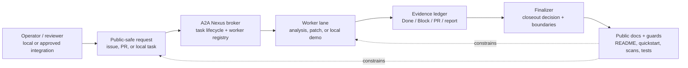

# A2A Nexus public architecture

This page is a public-safe conceptual architecture map for A2A Nexus. It describes the project shape for external readers without exposing private deployments, live broker URLs, node names, provider identifiers, Telegram identifiers, production data, or secrets. The diagram is a broker/worker/finalizer/evidence overview, not a deployment topology.

## One-screen conceptual map

## Components

| Component | Public role | Boundary |
|---|---|---|
| Operator / reviewer | Chooses whether work is safe to dispatch and whether evidence is enough to close out. | Does not imply production authorization. |
| A2A Nexus broker | Owns task lifecycle, worker registration, status, and terminal evidence contracts. | Public docs use conceptual or loopback examples only. |
| Worker lane | Performs bounded analysis, patch, or local demo work and reports evidence. | Public examples must not require private credentials, production brokers, or live provider sends. |
| Evidence ledger | Records `Done`, `Block`, PR links, validation output, and closeout notes. | Evidence must be redacted and public-safe. |
| Finalizer | Turns worker evidence into a close/keep-open decision with explicit non-actions. | Cannot convert gated release/deploy/settings work into implicit approval. |
| Public docs + guards | Keep external-reader paths reproducible and safe. | Guard changes are source-only unless separately approved. |

## External-reader flow

1. Read the [README](../README.md) first screen for the one-sentence identity and public-alpha boundary.
2. Run the [five-minute local quickstart](quickstart.md) using loopback/local fixtures only.
3. Use [contribution entry points](contribution-entry-points.md) for public-safe first tasks.
4. Check [release readiness](release-readiness.md) before making any release, tag, npm, Docker, or GHCR claim.
5. Use the [public-alpha landing draft](public-alpha-landing.md) as a future homepage candidate only after separate approval.

## What this diagram intentionally omits

- private hostnames, live broker URLs, private node names, internal service ports, provider IDs, Telegram IDs, or production data;
- deployment topology, credentials, secret locations, or runtime session dumps;
- release, package, image, homepage, or broad-promotion approval.

Any future deployment diagram or homepage setting needs a separate operator-approved task.
