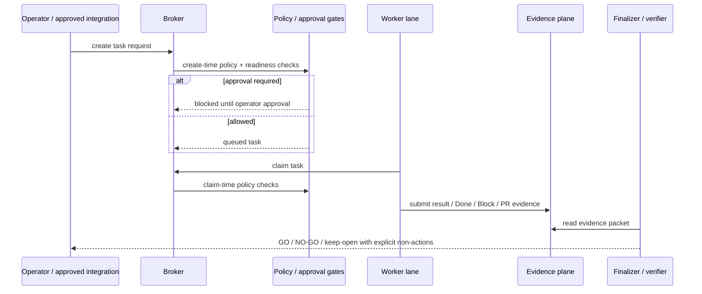
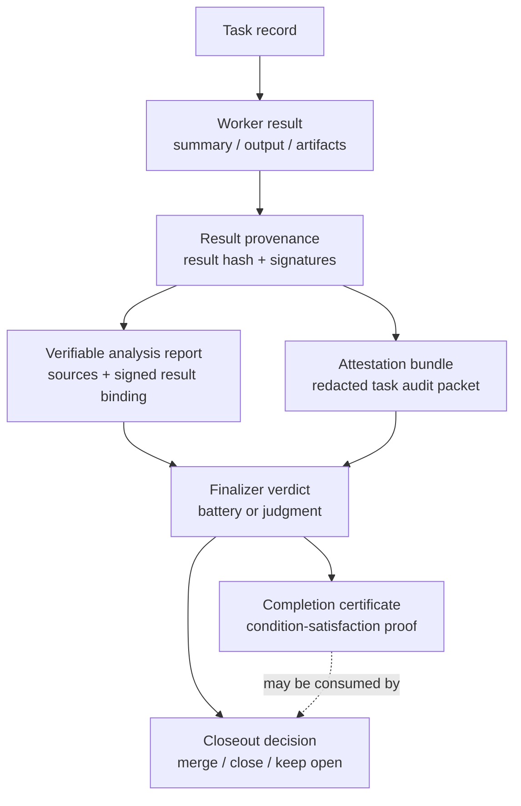

# A2A Nexus public architecture

This page is a public-safe conceptual architecture map for A2A Nexus. It describes the project shape for external readers without exposing private deployments, live broker URLs, node names, provider identifiers, Telegram identifiers, production data, or secrets. The diagram is a broker/worker/finalizer/evidence overview, not a deployment topology.

A2A Nexus is best read as an **operator-gated referee and evidence plane** around delegated work. It includes a broker/worker runtime, but the durable value is the trust boundary around that runtime: task lifecycle evidence, approval gates, source-only analysis lanes, isolated patch execution, signed verdicts, and offline-verifiable proof objects.

## One-screen conceptual map

```mermaid
flowchart LR
  operator["Operator / reviewer\nlocal or approved integration"]
  intake["Public-safe request\nissue, PR, or local task"]
  plugin["Integration plugin\nAPI adapter / intake surface"]
  broker["A2A Nexus broker\ntask lifecycle + registry"]
  policy["Policy + approval gates\nclass rules / operator approvals"]
  worker["Worker lane\nanalysis or bounded execution"]
  runner["Docker runner\nisolated repo work"]
  evidence["Evidence plane\nDone / Block / PR / report"]
  finalizer["Finalizer / verifier\nGO/NO-GO + boundaries"]
  certificate["Proof artifacts\nattestation / verdict / certificate"]
  docs["Public docs + guards\nREADME, quickstart, scans, tests"]

  operator --> intake --> plugin --> broker --> policy --> worker
  worker --> evidence --> finalizer --> certificate
  worker -. explicit patch lane .-> runner -. bounded artifacts .-> evidence
  docs -. constrains .-> intake
  docs -. constrains .-> worker
  docs -. constrains .-> finalizer
```

## Component boundaries

| Component | Public role | Boundary |
|---|---|---|
| Operator / reviewer | Chooses whether work is safe to dispatch and whether evidence is enough to close out. | Does not imply production authorization, release approval, or live mutation approval. |
| Integration plugin | Adapts an approved intake surface to broker task requests and status reads. | Must not bypass broker validation, approval gates, or redaction rules. |
| A2A Nexus broker | Owns task creation, assignment, claim, status, terminal evidence contracts, worker registry, and class-based policy evaluation. | Public docs use conceptual or loopback examples only; the broker is not a public topology map. |
| Worker lane | Performs bounded analysis, review, or explicitly approved execution and returns structured evidence. | Prompt text is not a safety boundary; the broker and lane mode define what is allowed. |
| Docker runner | Provides isolated repository checkout and patch/PR execution for approved patch lanes. | It is not a general shell surface and must keep write-set and credential boundaries explicit. |
| Evidence plane | Records `Done`, `Block`, PR links, validations, reports, and bounded failure excerpts. | Evidence must be redacted, public-safe, and distinguish missing evidence from empty evidence. |
| Finalizer / verifier | Turns worker evidence into a close/keep-open decision and checks proof-object validity. | A valid verdict proves review/integrity occurred; it does not prove analytical correctness. |
| Proof artifacts | Attestation bundles, verifiable analysis reports, finalizer verdicts, and completion certificates. | They are offline-verifiable evidence objects, not payment, deployment, or release authorization. |
| Public docs + guards | Keep external-reader paths reproducible and safe. | Guard changes are source-only unless separately approved. |

See [Trust boundaries and proof primitives](trust-boundaries.md) for the companion catalog of safety rules and reusable proof objects.

## Task lifecycle and gate positions

Gate placement matters:

| Stage | Gate | What it protects |
|---|---|---|
| Create-time | request shape, readiness, broker policy, approval requirements | Prevents unsafe tasks from entering the queue or routes them to recoverable operator approval. |
| Claim-time | worker class and task policy re-evaluation | Prevents a worker with the wrong class from claiming work that was safe only for another class. |
| Execution lane | source-only / read-only / patch / live boundaries | Keeps analysis, repository patching, and live mutation as distinct modes. |
| Evidence submission | result provenance, redaction, bounded excerpts | Keeps terminal evidence auditable without leaking secrets or private topology. |
| Finalizer / verifier | subject binding, independence, signature/integrity checks | Ensures the closeout decision is tied to the exact artifact and is not self-certified. |

## Source-only lanes vs live mutation lanes

A2A Nexus treats "read or analyze" and "mutate something" as different products, not different phrasings of the same prompt.

| Lane kind | Allowed examples | Not authorized by the lane |
|---|---|---|
| Source-only analysis | issue triage, design review, PR review, source-bundle inspection, offline fixture validation | GitHub writes, deploys, restarts, provider sends, DB/outbox/ACK/replay/prune/migration, secrets, releases |
| Read-only validation | local checks, offline verifier runs, frozen snapshot verification | New network fetch paths or live proxy activation unless separately approved |
| Patch / PR lane | bounded repository edits and a PR when the lane contract explicitly permits writes | Live deployment, release/tag/package publication, credential movement |
| Live mutation lane | only a separately approved, bounded live action with rollback evidence | Implicit approval from a source-only packet, issue label, or prompt text |

The write-set safety rule is simple: **a worker may write only the surfaces that the task contract explicitly names.** If a prompt asks for less than the lane mode allows, the contract still wins; if a prompt asks for more than the lane mode allows, the broker/runner/finalizer must fail closed or keep the issue open.

## Evidence lifecycle

The proof objects are deliberately narrow:

- [Attestation bundles](attestation-bundle.md) answer "can you audit what happened to this task?" without exposing raw node identities or secrets. Missing evidence is recorded as `missing`, not silently treated as empty.
- [Verifiable analysis reports](../contracts/a2a/verifiable-analysis-report.md) prove source grounding, process provenance, and integrity. They do **not** prove the analysis is correct.
- [Finalizer verdicts](../contracts/a2a/finalizer-verdict.md) prove that an independent finalizer rendered a subject-bound GO/NO-GO verdict. `battery` verdicts can be reproducible; `judgment` verdicts attest that review occurred and do not claim reproducibility.
- [Completion certificates](../contracts/a2a/completion-certificate.md) package condition evaluation into an offline-verifiable object. They do **not** move funds, authorize payment release, or call payment rails.

## Broker policy and approval gates

Broker policy is a class-based referee primitive: anonymous worker classes, not named workers, determine what can be created or claimed. The public contract is [Broker Policy Document v1](../contracts/a2a/broker-policy.md).

At architecture level, remember three boundaries:

1. Policy rules gate task lifecycle; they do not re-run finalizer judgment.
2. `requireApproval` is a recoverable blocked state; a deny is not.
3. Promotion of any policy from observation to enforcement is an operator cutoff decision, not an automatic consequence of documentation or tests.

## Nexus core vs feature repo candidates

`a2a-nexus` remains the canonical monorepo for the broker, plugin, Docker runner, shared contracts, public docs, and readiness gates. Feature repos can be derived only when a primitive has a clear contract and a public-safe boundary.

| Surface | Stays in Nexus core | Natural feature-repo candidate when ready |
|---|---|---|
| Broker runtime | task lifecycle, worker registry, policy hooks, persistence, status APIs | policy-referee extraction only after policy semantics are stable and separately approved |
| Evidence/proof contracts | shared schemas, conformance fixtures, offline verifiers | agent-work-proof, verifiable-analysis-report, certification-battery |
| Payment-adjacent proof | completion certificate contract and no-live rehearsals | escrow-proof adapter only as proof-of-condition, not funds custody |
| Patch execution | Docker runner source and public-safe local demos | runner-specific packaging when publication/release gates are separately approved |
| Integration adapters | reference plugin contracts and examples | additional protocol adapters that preserve broker validation and write-set rules |

## External-reader flow

1. Read the [README](../README.md) first screen for the one-sentence identity and public-alpha boundary.
2. Run the [five-minute local quickstart](quickstart.md) using loopback/local fixtures only.
3. Read [Trust boundaries and proof primitives](trust-boundaries.md) before assuming a proof object authorizes a live action.
4. Use [contribution entry points](contribution-entry-points.md) for public-safe first tasks.
5. Check [release readiness](release-readiness.md) before making any release, tag, npm, Docker, or GHCR claim.
6. Use the [public-alpha landing draft](public-alpha-landing.md) as a future homepage candidate only after separate approval.

## What this diagram intentionally omits

- private hostnames, live broker URLs, private node names, internal service ports, provider IDs, Telegram IDs, or production data;
- deployment topology, credentials, secret locations, runtime session dumps, or operator environment paths;
- release, package, image, homepage, or broad-promotion approval;
- any claim that a valid proof object certifies correctness, legal settlement, payment authorization, or live deployment readiness.

Any future deployment diagram or homepage setting needs a separate operator-approved task.
