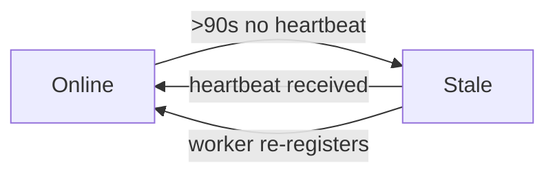

# Mobile Worker Health Runbook

> **mobilealpha**, **mobilebeta** — Team1/Team2 Hermes/Termux mobile workers running on
> Android devices. These nodes connect via HTTP poll and may sleep briefly (Android
> Doze, lid close, network suspend).
>
> **#2065 scope note:** the `workerMode` registration field and the mobile-specific
> `mobileHealth` projection are **retired**. Brokers tolerate a supplied `workerMode`
> value but drop it: registration/heartbeat no longer persist it and no read surface
> echoes it. There is also **no enforced 3-task concurrency limit** for mobile
> workers; earlier revisions of this runbook described a "reduced capacity of 3
> concurrent slots", which overstated computed telemetry as an enforcement claim.
> Policy and fast-lane decisions are unchanged by the retirement.

## Identifying the mobile profile

There is no broker-side "mobile" classification any more. mobilealpha and
mobilebeta are identified by their node IDs and self-declared registration
metadata, typically:

- `runtimeFlavor: "termux-hermes"` (metadata)
- `canAnalyze: true`
- `canPromoteLive: false`
- no Docker runner requirement

Treat mobilealpha and mobilebeta as **non-docker Hermes research workers**, not as
reference-only special cases. They can receive ordinary no-live/read-only
`analyze` or `verify` tasks, including A2A/A2AD round tasks, when task policy is
research-only and the payload is explicitly no-live. They must still reject
Docker-runner, live-impact, provider-send, and generic GitHub-write executor
payloads unless a separate approved proof-marker path is used.

## Health States (broker-facing status)

Every read surface — raw `GET /workers`, `GET /workers/:id`, `/dashboard`,
`/workers/capacity`, and `a2a.peer.status` — resolves the same common window:
`workerOfflineAfterMs ?? DEFAULT_WORKER_OFFLINE_AFTER_MS` (90 s). A worker is
`stale` once its heartbeat age exceeds the resolved window; there is no separate
mobile ladder and no synthesized `mobileHealth` field on any surface.

### State Table



| `status` | lastSeenAgeSec | Meaning | Operator action |
|---|---|---|---|
| `online` | ≤ 90 s (resolved window) | Worker heartbeating normally; brief Doze sleeps stay within the window | None |
| `stale` | > resolved window | Worker unreachable beyond the window; likely offline, battery-dead, or network lost | Check device connectivity and battery |

`a2a.peer.status` reports `health: "ok"` within the same window and
`health: "stale"` past it; unregistered targets report `health: "unreachable"`.
Because all surfaces share one window, the former "dashboard `stale` while
`a2a.peer.status` still `ok`" divergence cannot occur.

## Thresholds (code constants)

| Constant | Value | Applies to |
|---|---|---|
| `DEFAULT_WORKER_OFFLINE_AFTER_MS` | 90,000 (90 s) | Default worker staleness window; every read surface resolves `workerOfflineAfterMs ??` this value |
| `HEARTBEAT_LIVENESS_ONLINE_WINDOW_MS` | 30,000 (30 s) | Conversation-delivery online window (`getConversationDeliverySummary` ladder); **not** a worker-staleness default |
| `HEARTBEAT_LIVENESS_OFFLINE_AFTER_MS` | 90,000 (90 s) | Conversation-delivery stale→offline boundary; **not** a worker-staleness default |

`getConversationDeliverySummary()` classifies conversation-participant liveness
with the neutral heartbeat-liveness ladder: `HEARTBEAT_LIVENESS_ONLINE_WINDOW_MS`
(30 s online, inclusive) and `HEARTBEAT_LIVENESS_OFFLINE_AFTER_MS` (up to 90 s
stale, inclusive, then offline). This ladder is migration-coupled naming only —
it describes the pre-existing conversation/legacy-health behaviour and is not a
default for raw `GET /workers`, `/dashboard`, `/workers/capacity`, or
`a2a.peer.status`, which keep the common 90 s window described above. (The
retirement removed the legacy `MOBILE_OFFLINE_AFTER_MS` /
`MOBILE_DISCONNECTED_AFTER_MS` names together with the mobile-only override.)

## Code Locations

- **Types**: `src/core/types.ts` — `WorkerFleetSummary`, `WorkerCapacitySummaryItem` (`workerOfflineAfterMs`)
- **Stale detection**: `src/core/broker-worker-status.ts` — `isWorkerStale()`, `HEARTBEAT_LIVENESS_*` constants
- **Common default**: `src/core/broker-contracts.ts` — `DEFAULT_WORKER_OFFLINE_AFTER_MS`, registration `workerOfflineAfterMs` option
- **Dashboard**: `src/core/broker.ts` — `getDashboard()` (workers section)
- **Capacity**: `src/core/broker.ts` — `getWorkerCapacitySummary()`
- **Peer status**: `src/a2a/peer-status.ts` — `a2a.peer.status` (common window + 10 advisory busy slots)

## Known Mobile Workers

| Node ID | Team | Device | Notes |
|---|---|---|---|
| `mobilealpha` | Team1 | Termux (Android) | Non-docker Hermes research worker; accepts no-live/read-only analysis tasks. |
| `mobilebeta` | Team2 | Termux (Android) | Non-docker Hermes research worker; accepts no-live/read-only analysis tasks. |

## Operational Notes

1. **Mobile workers may briefly go stale** during Android Doze or after a network
   handoff. A single stale event is not cause for alarm; check `lastSeenAgeSec`
   to assess recency. Brief sleeps (≤ 90 s) usually stay within the common
   window and never surface as `stale`.
2. **No per-mode concurrency limit is enforced.** There is no universal
   "3 concurrent tasks" cap for mobile workers; `activeTaskCount` is computed
   telemetry and does not read or set executor concurrency. The read-only
   `a2a.peer.status` view additionally reports an advisory busy hint
   (`active + queued` vs a fixed budget of 10, identical for every worker) —
   it is telemetry, never an admission permission.
3. **One window everywhere.** Raw, dashboard, capacity, and peer-status reads
   share `workerOfflineAfterMs ?? 90 s`. A registered `workerOfflineAfterMs`
   overrides the default; resolution uses `??`, preserving explicit zero and
   windows longer than the default.
4. If a mobile worker remains disconnected for an extended period (>14 days by
   default retention), it becomes a cleanup candidate for `discoverCleanupCandidates`.

## Dashboard Example

```json
{
  "workers": {
    "total": 3,
    "online": 2,
    "stale": 1,
    "byNode": [
      {
        "nodeId": "brokeralpha",
        "role": "hub",
        "status": "online",
        "activeTaskCount": 0,
        "lastSeenAgeSec": 5
      },
      {
        "nodeId": "mobilealpha",
        "role": "analyst",
        "status": "online",
        "activeTaskCount": 1,
        "lastSeenAgeSec": 12
      },
      {
        "nodeId": "mobilebeta",
        "role": "analyst",
        "status": "stale",
        "activeTaskCount": 0,
        "lastSeenAgeSec": 145
      }
    ]
  }
}
```
