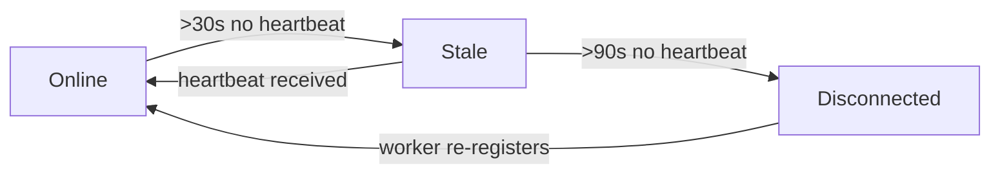

# Mobile Worker Health Runbook

> **mobilealpha**, **mobilebeta** — Team1 Hermes/Termux mobile workers running on Android
> devices. These nodes connect via HTTP poll, may sleep briefly (Android Doze, lid
> close, network suspend), and have a reduced capacity of 3 concurrent slots.

## Detecting Mobile Workers

A worker is classified as **mobile** when its `WorkerRecord.workerMode` is `"mobile"`.
Mobile workers are typically registered with:

- `runtimeFlavor: "termux-hermes"`
- `workerMode: "mobile"`
- `canAnalyze: true`
- `canPromoteLive: false`
- no Docker runner requirement

Treat mobilealpha and mobilebeta as **non-docker Hermes research workers**, not as
reference-only special cases. They can receive ordinary no-live/read-only
`analyze` or `verify` tasks, including A2A/A2AD round tasks, when task policy is
research-only and the payload is explicitly no-live. They must still reject
Docker-runner, live-impact, provider-send, and generic GitHub-write executor
payloads unless a separate approved proof-marker path is used.

## Health States (broker-facing status)

The `WorkerFleetSummary.byNode` and `WorkerCapacitySummaryItem` responses include
two mobile-specific fields for mobile workers:

| Field | Type | Present When |
|---|---|---|
| `workerMode` | `"persistent"` \| `"mobile"` | Always; absent defaults to `"persistent"` |
| `mobileHealth` | `"health_ok"` \| `"stale"` \| `"disconnected"` | Only when `workerMode === "mobile"` |

### State Table



| mobileHealth | lastSeenAgeSec | Meaning | Operator action |
|---|---|---|---|
| `health_ok` | ≤ 30s | Worker heartbeating normally within its mobile window | None |
| `stale` | > 30s, ≤ 90s | Worker missed 1–2 heartbeat cycles; may be briefly sleeping or on battery | Check device connectivity if pattern persists |
| `disconnected` | > 90s | Worker unreachable for an extended period; likely offline or power-cycled | Investigate device health; may have lost network or battery died |

> **Note:** The generic `status` field (`"online"` / `"stale"`) reflects the
> mobile-aware stale threshold (30s default). A worker with `status: "stale"`
> and `mobileHealth: "health_ok"` should not occur — they are kept in sync.

## Thresholds (code constants)

| Constant | Value | Applies to |
|---|---|---|
| `DEFAULT_WORKER_OFFLINE_AFTER_MS` | 90,000 (90 s) | Persistent workers (server/VPS) |
| `MOBILE_OFFLINE_AFTER_MS` | 30,000 (30 s) | Mobile workers (Termux/Hermes) |
| `MOBILE_DISCONNECTED_AFTER_MS` | 90,000 (90 s) | Mobile workers — disconnected threshold |

## Code Locations

- **Types**: `src/core/types.ts` — `WorkerMobileHealth`, `WorkerFleetSummary`, `WorkerCapacitySummaryItem`
- **Stale detection**: `src/core/broker.ts` — `effectiveOfflineAfterMs()`, `computeWorkerMobileHealth()`, `isWorkerStale()`
- **Dashboard**: `src/core/broker.ts` — `getDashboard()` (workers section)
- **Capacity**: `src/core/broker.ts` — `getWorkerCapacitySummary()` (per-item loop)

## Known Mobile Workers

| Node ID | Team | Device | Notes |
|---|---|---|---|
| `mobilealpha` | Team1 | Termux (Android) | Non-docker Hermes research worker; accepts no-live/read-only analysis tasks. |
| `mobilebeta` | Team2 | Termux (Android) | Non-docker Hermes research worker; accepts no-live/read-only analysis tasks. |

## operatorEvents Payload Constraint

The `mobileHealth` and `workerMode` fields are **only** present in the broker-facing
status APIs (`getDashboard`, `getWorkerCapacitySummary`). They are **not** added
to `TerminalTaskOutboxEvent` (the `operatorEvents` SSE/outbox payload), in order
to avoid inflating high-churn event streams with per-worker metadata.

## Operational Notes

1. **Mobile workers may briefly go stale** during Android Doze or after a network
   handoff. A single stale event is not cause for alarm; check `lastSeenAgeSec`
   to assess recency.
2. **Capacity is limited** to 3 concurrent slots. A mobile worker reporting
   `activeTaskCount: 3` is fully saturated.
3. **Gateway reachability** is `false` when the worker is stale or disconnected;
   the `PeerStatusService` will report `health: "stale"` or `health: "unreachable"`.
4. If a mobile worker remains disconnected for an extended period (>14 days by
   default retention), it becomes a cleanup candidate for `discoverCleanupCandidates`.

## Dashboard Example

```json
{
  "workers": {
    "total": 3,
    "online": 2,
    "stale": 1,
    "byNode": [
      {
        "nodeId": "brokeralpha",
        "role": "hub",
        "status": "online",
        "activeTaskCount": 0,
        "lastSeenAgeSec": 5
      },
      {
        "nodeId": "mobilealpha",
        "role": "analyst",
        "status": "online",
        "workerMode": "mobile",
        "mobileHealth": "health_ok",
        "activeTaskCount": 1,
        "lastSeenAgeSec": 12
      },
      {
        "nodeId": "mobilebeta",
        "role": "analyst",
        "status": "stale",
        "workerMode": "mobile",
        "mobileHealth": "stale",
        "activeTaskCount": 0,
        "lastSeenAgeSec": 45
      }
    ]
  }
}
```
